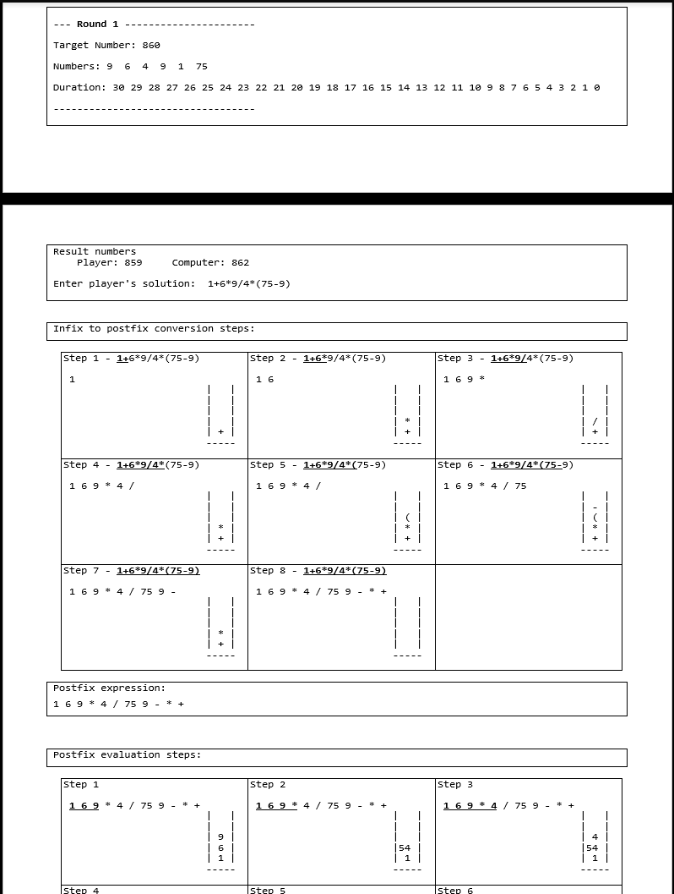
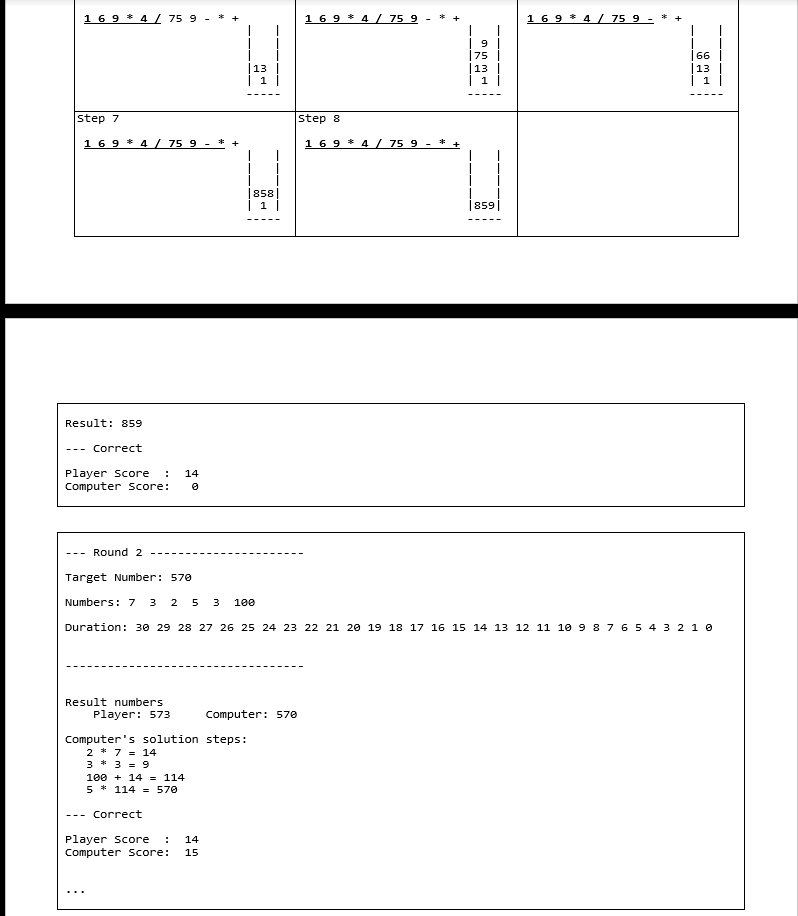

# AI Number Finder

- The aim of the project is to develop a game in which player and AI try to reach the target number by calculating all possible combinations of given numbers with four operations (+, -, *, /) in limited time.
- Stack, queue data structures and infix, postfix expressions used to implement program.
- Enigma used for visualization.
- General Information :

- Sample Screen :

